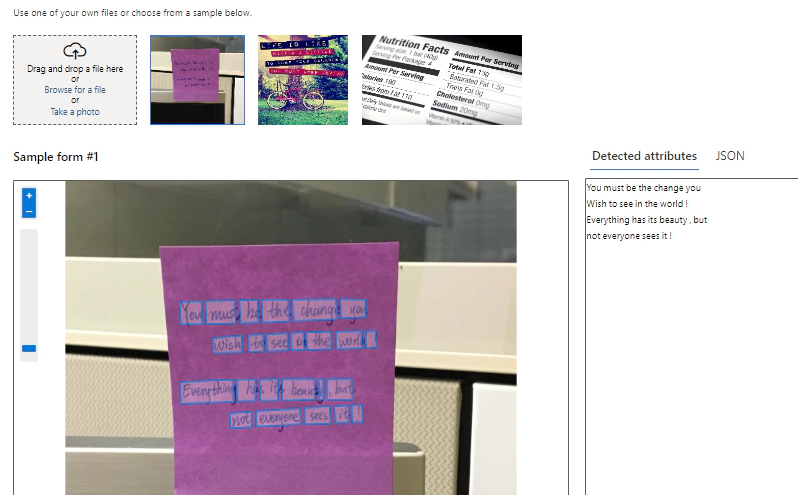
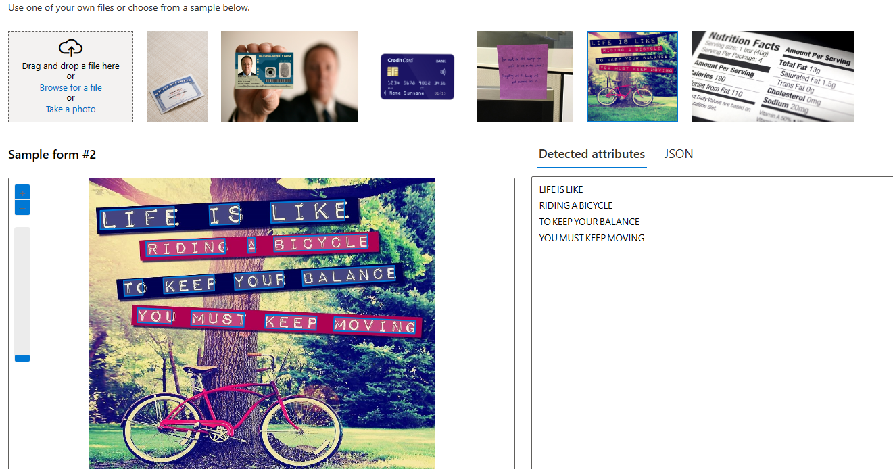

<h1>
    
     
Recursos de IA Generativa

</h1>

### Add captions to imagens

Através deste recurso a Inteligência Artificial descreve o que esta presente na imagem, possibilitando assim que deficientes visuais saibam o que esta presente na foto ou video.

## Imagens de entrada

...

## Resultados

...

## Considerações finais

O recurso de reconhecimento e extração de textos em imagens do Azure permite que empresas identifiquem e capturem informações de documentos de forma rápida e segura. Ele pode ser usado para reconhecer e arquivar documentos, incluindo notas fiscais, bastando inserir a imagem do documento na ferramenta para que os dados sejam automaticamente reconhecidos.